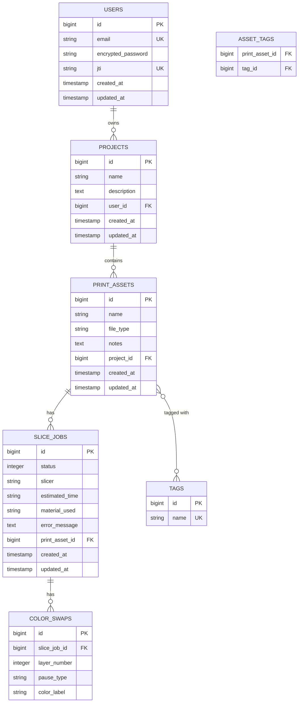

# LayerHub — Implementation Plan

> **3D Print Asset Manager & Cloud Slicer**
> A web-based workflow tool for 3D printing. Upload STL files, manage a 3D asset library, trigger background slicing jobs, and run a custom Ruby G-code post-processor that injects manual pause commands for multi-color Bambu Lab A1 prints without AMS.

---

## Tech Stack

| Layer | Technology |
|---|---|
| **Backend** | Ruby on Rails 7 (API-only mode) |
| **Database** | PostgreSQL 15 |
| **File Storage** | Active Storage (local disk / Docker volume) |
| **Background Jobs** | Sidekiq + Redis |
| **Frontend** | Vue.js 3 (Composition API) + Vite + Tailwind CSS |
| **3D Viewer** | Three.js + STLLoader |
| **Slicer CLI** | PrusaSlicer CLI / Bambu Studio CLI (headless) |
| **Auth** | Devise + devise-jwt (stateless JWT) |
| **Infrastructure** | Docker Compose (Rails, PostgreSQL, Redis, Sidekiq) |

---

## Development Environment

The entire stack runs in **Docker Compose** — no need to install Ruby, PostgreSQL, or Redis on your host machine. Your WSL Ruby/Rails installation can still be used for running generators (`rails g model ...`) or `bundle exec rspec` directly if you prefer faster iteration, but the app itself always runs inside containers.

```
┌─────────────────────────────────────────────────────┐
│  Docker Compose                                     │
│                                                     │
│  ┌──────────┐  ┌──────────┐  ┌──────────┐          │
│  │  Rails    │  │ Sidekiq  │  │  Vite    │          │
│  │  API :3000│  │ Worker   │  │  Dev :5173│         │
│  └────┬─────┘  └────┬─────┘  └──────────┘          │
│       │              │                               │
│  ┌────▼─────┐  ┌────▼─────┐                         │
│  │ PostgreSQL│  │  Redis   │                         │
│  │  :5432   │  │  :6379   │                         │
│  └──────────┘  └──────────┘                         │
└─────────────────────────────────────────────────────┘
```

---

## Entity-Relationship Diagram



---

## Phase 1 — Project Bootstrap, Docker & Auth

**Goal:** Stand up the Rails API skeleton, PostgreSQL, Redis, and JWT authentication inside Docker Compose so every subsequent feature has a secure, containerized foundation.

### 1.1 — Generate the Rails API App

```bash
# From your WSL terminal (or anywhere with Rails installed)
rails new layerhub_api --api --database=postgresql -T
cd layerhub_api
```

- `--api` strips browser middleware (cookies, sessions, CSRF, views) — keeps the app lean for a JSON API
- `--database=postgresql` configures `pg` gem and `database.yml`
- `-T` skips Minitest; we'll add RSpec

### 1.2 — Gemfile Additions

Add these to `Gemfile`:

```ruby
# Authentication
gem "devise"
gem "devise-jwt"

# CORS (allow Vue dev server to talk to Rails)
gem "rack-cors"

# Background jobs
gem "sidekiq", "~> 7.0"
gem "redis", "~> 5.0"

group :development, :test do
  gem "rspec-rails"
  gem "factory_bot_rails"
  gem "faker"
end
```

```bash
bundle install
```

**Why these gems?**
- `devise` is the de facto Rails auth solution (8M+ downloads). `devise-jwt` adds stateless JWT on top — perfect for API-only mode where you can't use cookie-based sessions.
- `rack-cors` adds the `Access-Control-Allow-Origin` header so the Vue app at `localhost:5173` can make requests to Rails at `localhost:3000`.
- `sidekiq` uses Redis-backed queues and threads (not processes) to run background jobs — far more memory-efficient than Active Job's default async adapter. A single Sidekiq process can handle dozens of concurrent slicing jobs.

### 1.3 — Docker Compose Setup

Create these files in the `layerhub_api/` root:

**`Dockerfile`**

```dockerfile
FROM ruby:3.3-slim

# Install system dependencies
RUN apt-get update -qq && \
    apt-get install -y --no-install-recommends \
    build-essential libpq-dev git curl && \
    rm -rf /var/lib/apt/lists/*

# Install PrusaSlicer CLI (for slicing jobs)
# Uncomment when ready to test slicing:
# RUN apt-get update -qq && apt-get install -y prusa-slicer

WORKDIR /app

# Install gems (cached layer)
COPY Gemfile Gemfile.lock ./
RUN bundle install

# Copy app code
COPY . .

EXPOSE 3000

CMD ["rails", "server", "-b", "0.0.0.0"]
```

**`docker-compose.yml`**

```yaml
version: "3.8"

services:
  db:
    image: postgres:15-alpine
    environment:
      POSTGRES_USER: layerhub
      POSTGRES_PASSWORD: layerhub_dev
      POSTGRES_DB: layerhub_development
    volumes:
      - pgdata:/var/lib/postgresql/data
    ports:
      - "5432:5432"

  redis:
    image: redis:7-alpine
    ports:
      - "6379:6379"

  api:
    build: .
    command: bash -c "rm -f tmp/pids/server.pid && rails server -b 0.0.0.0"
    volumes:
      - .:/app
      - bundle_cache:/usr/local/bundle
      - storage:/app/storage
    ports:
      - "3000:3000"
    depends_on:
      - db
      - redis
    environment:
      DATABASE_URL: postgres://layerhub:layerhub_dev@db:5432/layerhub_development
      REDIS_URL: redis://redis:6379/0
      RAILS_ENV: development
      DEVISE_JWT_SECRET_KEY: dev-secret-key-change-in-production

  sidekiq:
    build: .
    command: bundle exec sidekiq
    volumes:
      - .:/app
      - bundle_cache:/usr/local/bundle
      - storage:/app/storage
    depends_on:
      - db
      - redis
    environment:
      DATABASE_URL: postgres://layerhub:layerhub_dev@db:5432/layerhub_development
      REDIS_URL: redis://redis:6379/0
      RAILS_ENV: development

  frontend:
    image: node:20-alpine
    working_dir: /app
    command: sh -c "npm install && npm run dev -- --host 0.0.0.0"
    volumes:
      - ../layerhub_ui:/app
      - node_modules:/app/node_modules
    ports:
      - "5173:5173"

volumes:
  pgdata:
  bundle_cache:
  storage:
  node_modules:
```

**How to start everything:**

```bash
docker compose up --build
```

This starts all 5 services. Rails API at `localhost:3000`, Vue frontend at `localhost:5173`, Sidekiq processing in the background, PostgreSQL and Redis running quietly.

**Why Docker Compose?**
- One command spins up the entire stack — no "works on my machine" problems
- Shared `storage` volume means both `api` and `sidekiq` containers can read/write Active Storage files (critical for the slicing pipeline)
- Shows DevOps awareness on your portfolio — interviewers love seeing a `docker-compose.yml`

### 1.4 — Configure CORS

**`config/initializers/cors.rb`**

```ruby
Rails.application.config.middleware.insert_before 0, Rack::Cors do
  allow do
    origins "http://localhost:5173"  # Vite dev server

    resource "*",
      headers: :any,
      methods: [:get, :post, :put, :patch, :delete, :options, :head],
      expose: ["Authorization"]  # Expose JWT header to frontend
  end
end
```

The `expose: ["Authorization"]` line is critical — without it, the browser's CORS policy hides the `Authorization` response header and the frontend can't read the JWT after login.

### 1.5 — Set Up Devise + JWT

```bash
rails generate devise:install
rails generate devise User
```

Add `jti` column to the Devise migration before running it:

```ruby
# db/migrate/xxxx_devise_create_users.rb
class DeviseCreateUsers < ActiveRecord::Migration[7.0]
  def change
    create_table :users do |t|
      t.string :email,              null: false, default: ""
      t.string :encrypted_password, null: false, default: ""
      t.string :jti,                null: false

      t.timestamps null: false
    end

    add_index :users, :email, unique: true
    add_index :users, :jti,   unique: true
  end
end
```

**`app/models/user.rb`**

```ruby
class User < ApplicationRecord
  include Devise::JWT::RevocationStrategies::JTIMatcher

  devise :database_authenticatable, :registerable,
         :validatable,
         :jwt_authenticatable, jwt_revocation_strategy: self

  has_many :projects, dependent: :destroy
end
```

**`config/initializers/devise.rb`** (add inside the `Devise.setup` block):

```ruby
config.jwt do |jwt|
  jwt.secret = ENV.fetch("DEVISE_JWT_SECRET_KEY") { Rails.application.credentials.devise_jwt_secret_key }
  jwt.dispatch_requests = [
    ["POST", %r{^/api/v1/login$}]
  ]
  jwt.revocation_requests = [
    ["DELETE", %r{^/api/v1/logout$}]
  ]
  jwt.expiration_time = 24.hours.to_i
end
```

**Why JTI revocation?** It's the simplest devise-jwt strategy. No extra tables, no Redis blocklist. The `jti` column on the user rotates on logout, immediately invalidating the old token. In an interview, you can explain: *"We chose JTI revocation because it's zero-infrastructure — the revocation state lives on the user row itself. The tradeoff is that only one token is valid at a time per user, which is fine for our use case."*

### 1.6 — Configure Active Storage

```bash
rails active_storage:install
```

**`config/storage.yml`**

```yaml
local:
  service: Disk
  root: <%= Rails.root.join("storage") %>
```

Active Storage creates 3 tables: `active_storage_blobs` (file metadata — filename, content type, byte size, checksum), `active_storage_attachments` (polymorphic join linking blobs to any model), and `active_storage_variant_records` (for image transforms — we won't use this). The key insight is that **you never add file columns to your models** — Active Storage uses the attachments table to link files polymorphically.

### 1.7 — Run Migrations

```bash
# Inside Docker:
docker compose run api rails db:create db:migrate

# Or from WSL if you have Rails locally:
rails db:create db:migrate
```

### 1.8 — Auth Controllers

```bash
rails g controller Api::V1::Registrations
rails g controller Api::V1::Sessions
```

**`app/controllers/api/v1/registrations_controller.rb`**

```ruby
class Api::V1::RegistrationsController < Devise::RegistrationsController
  respond_to :json

  private

  def respond_with(resource, _opts = {})
    if resource.persisted?
      render json: { message: "Signed up successfully.", user: resource.as_json(only: [:id, :email]) }, status: :created
    else
      render json: { errors: resource.errors.full_messages }, status: :unprocessable_entity
    end
  end
end
```

**`app/controllers/api/v1/sessions_controller.rb`**

```ruby
class Api::V1::SessionsController < Devise::SessionsController
  respond_to :json

  private

  def respond_with(_resource, _opts = {})
    render json: { message: "Logged in successfully." }, status: :ok
  end

  def respond_to_on_destroy
    if current_user
      render json: { message: "Logged out successfully." }, status: :ok
    else
      render json: { message: "No active session." }, status: :unauthorized
    end
  end
end
```

**`config/routes.rb`**

```ruby
Rails.application.routes.draw do
  namespace :api do
    namespace :v1 do
      devise_for :users,
        path: "",
        path_names: {
          sign_in: "login",
          sign_out: "logout",
          registration: "signup"
        },
        controllers: {
          sessions: "api/v1/sessions",
          registrations: "api/v1/registrations"
        }
    end
  end
end
```

### 1.9 — Configure Sidekiq

**`config/initializers/sidekiq.rb`**

```ruby
Sidekiq.configure_server do |config|
  config.redis = { url: ENV.fetch("REDIS_URL", "redis://localhost:6379/0") }
end

Sidekiq.configure_client do |config|
  config.redis = { url: ENV.fetch("REDIS_URL", "redis://localhost:6379/0") }
end
```

**`config/sidekiq.yml`**

```yaml
:concurrency: 5
:queues:
  - default
  - slicing
```

**`config/application.rb`** (add inside the class):

```ruby
config.active_job.queue_adapter = :sidekiq
```

### Schema After Phase 1

```
users
├── id            bigint PK
├── email         string, unique, not null
├── encrypted_password  string, not null
├── jti           string, unique, not null
├── created_at
├── updated_at

+ Active Storage tables (blobs, attachments, variant_records)
```

### Verify Phase 1

```bash
# Start everything
docker compose up --build

# Test signup
curl -X POST http://localhost:3000/api/v1/signup \
  -H "Content-Type: application/json" \
  -d '{"user": {"email": "test@example.com", "password": "password123"}}'

# Test login (JWT comes back in Authorization header)
curl -v -X POST http://localhost:3000/api/v1/login \
  -H "Content-Type: application/json" \
  -d '{"user": {"email": "test@example.com", "password": "password123"}}'

# Copy the Authorization header value, then:
curl -X DELETE http://localhost:3000/api/v1/logout \
  -H "Authorization: Bearer <your-jwt-token>"
```

---

## Phase 2 — Asset Management CRUD

**Goal:** Build the core domain models (Projects, PrintAssets, Tags) with full CRUD and file upload. After this phase you have a working 3D asset library.

### 2.1 — Generate Models

```bash
rails g model Project name:string description:text user:references
rails g model PrintAsset name:string file_type:string notes:text project:references
rails g model Tag name:string
rails g model AssetTag print_asset:references tag:references
```

Edit the `AssetTag` migration to add a composite unique index:

```ruby
# db/migrate/xxxx_create_asset_tags.rb
class CreateAssetTags < ActiveRecord::Migration[7.0]
  def change
    create_table :asset_tags do |t|
      t.references :print_asset, null: false, foreign_key: true
      t.references :tag, null: false, foreign_key: true
    end

    add_index :asset_tags, [:print_asset_id, :tag_id], unique: true
  end
end
```

```bash
docker compose run api rails db:migrate
```

### 2.2 — Model Associations & Validations

**`app/models/user.rb`** (add):

```ruby
has_many :projects, dependent: :destroy
```

**`app/models/project.rb`**

```ruby
class Project < ApplicationRecord
  belongs_to :user
  has_many :print_assets, dependent: :destroy

  validates :name, presence: true, length: { maximum: 255 }
end
```

**`app/models/print_asset.rb`**

```ruby
class PrintAsset < ApplicationRecord
  belongs_to :project
  has_one_attached :source_file
  has_many :asset_tags, dependent: :destroy
  has_many :tags, through: :asset_tags
  has_many :slice_jobs, dependent: :destroy

  validates :name, presence: true
  validates :file_type, inclusion: { in: %w[stl gcode 3mf], allow_blank: true }

  # Validate file content type on upload
  validate :acceptable_source_file

  private

  def acceptable_source_file
    return unless source_file.attached?

    allowed = [
      "model/stl",
      "application/sla",                # .stl alternate MIME
      "application/octet-stream",       # common fallback for .stl/.gcode
      "application/vnd.ms-pki.stl",     # Windows .stl MIME
      "text/x-gcode",                   # .gcode
      "text/plain"                      # .gcode often detected as text
    ]

    unless allowed.include?(source_file.content_type)
      errors.add(:source_file, "must be an STL, G-code, or 3MF file")
    end
  end
end
```

**`app/models/tag.rb`**

```ruby
class Tag < ApplicationRecord
  has_many :asset_tags, dependent: :destroy
  has_many :print_assets, through: :asset_tags

  validates :name, presence: true, uniqueness: { case_sensitive: false }
end
```

**`app/models/asset_tag.rb`**

```ruby
class AssetTag < ApplicationRecord
  belongs_to :print_asset
  belongs_to :tag
end
```

**Why `has_one_attached :source_file`?** This is Active Storage's convention — it creates a polymorphic association through the `active_storage_attachments` table. You never add a `file` column to your model. Rails handles uploading, storing, and serving the file. In your controller, you just pass `params[:source_file]` (a multipart upload) and Active Storage does the rest.

### 2.3 — Generate Controllers

```bash
rails g controller Api::V1::Projects
rails g controller Api::V1::PrintAssets
```

**`app/controllers/application_controller.rb`**

```ruby
class ApplicationController < ActionController::API
  before_action :authenticate_user!

  private

  def current_project
    @current_project ||= current_user.projects.find(params[:project_id])
  end
end
```

**`app/controllers/api/v1/projects_controller.rb`**

```ruby
class Api::V1::ProjectsController < ApplicationController
  before_action :set_project, only: [:show, :update, :destroy]

  # GET /api/v1/projects
  def index
    projects = current_user.projects.order(updated_at: :desc)
    render json: projects
  end

  # GET /api/v1/projects/:id
  def show
    render json: @project, include: :print_assets
  end

  # POST /api/v1/projects
  def create
    project = current_user.projects.build(project_params)

    if project.save
      render json: project, status: :created
    else
      render json: { errors: project.errors.full_messages }, status: :unprocessable_entity
    end
  end

  # PATCH /api/v1/projects/:id
  def update
    if @project.update(project_params)
      render json: @project
    else
      render json: { errors: @project.errors.full_messages }, status: :unprocessable_entity
    end
  end

  # DELETE /api/v1/projects/:id
  def destroy
    @project.destroy
    head :no_content
  end

  private

  def set_project
    @project = current_user.projects.find(params[:id])
  end

  def project_params
    params.require(:project).permit(:name, :description)
  end
end
```

**`app/controllers/api/v1/print_assets_controller.rb`**

```ruby
class Api::V1::PrintAssetsController < ApplicationController
  before_action :set_asset, only: [:show, :update, :destroy]

  # GET /api/v1/projects/:project_id/print_assets
  def index
    assets = current_project.print_assets.with_attached_source_file.order(created_at: :desc)
    render json: assets.map { |a| asset_json(a) }
  end

  # GET /api/v1/projects/:project_id/print_assets/:id
  def show
    render json: asset_json(@asset)
  end

  # POST /api/v1/projects/:project_id/print_assets
  def create
    asset = current_project.print_assets.build(asset_params)

    if asset.save
      render json: asset_json(asset), status: :created
    else
      render json: { errors: asset.errors.full_messages }, status: :unprocessable_entity
    end
  end

  # PATCH /api/v1/projects/:project_id/print_assets/:id
  def update
    if @asset.update(asset_params)
      render json: asset_json(@asset)
    else
      render json: { errors: @asset.errors.full_messages }, status: :unprocessable_entity
    end
  end

  # DELETE /api/v1/projects/:project_id/print_assets/:id
  def destroy
    @asset.destroy
    head :no_content
  end

  private

  def set_asset
    @asset = current_project.print_assets.find(params[:id])
  end

  def asset_params
    params.permit(:name, :file_type, :notes, :source_file, tag_ids: [])
  end

  def asset_json(asset)
    {
      id: asset.id,
      name: asset.name,
      file_type: asset.file_type,
      notes: asset.notes,
      tags: asset.tags.as_json(only: [:id, :name]),
      source_file_url: asset.source_file.attached? ? url_for(asset.source_file) : nil,
      created_at: asset.created_at,
      updated_at: asset.updated_at
    }
  end
end
```

### 2.4 — Routes

Add to `config/routes.rb` inside the `api/v1` namespace:

```ruby
namespace :api do
  namespace :v1 do
    # ... devise routes from Phase 1 ...

    resources :projects do
      resources :print_assets
    end
  end
end
```

**Why nested routes?** `/api/v1/projects/:project_id/print_assets` enforces the ownership hierarchy in the URL itself. Combined with `current_user.projects.find(params[:project_id])` in the controller, this is a Rails pattern called **"authorization through association"** — it prevents IDOR (Insecure Direct Object Reference) vulnerabilities without a separate authorization gem like Pundit. If user A tries to access user B's project via the URL, `find` raises `ActiveRecord::RecordNotFound` → Rails returns 404.

### Schema After Phase 2

```
users
├── id, email, encrypted_password, jti, timestamps

projects
├── id            bigint PK
├── name          string, not null
├── description   text
├── user_id       FK → users
├── timestamps

print_assets
├── id            bigint PK
├── name          string, not null
├── file_type     string (stl / gcode / 3mf)
├── notes         text
├── project_id    FK → projects
├── timestamps
  └── (source_file via Active Storage)

tags
├── id            bigint PK
├── name          string, unique, not null

asset_tags
├── print_asset_id  FK
├── tag_id          FK
  └── (composite unique index)
```

### Verify Phase 2

```bash
# Create a project
curl -X POST http://localhost:3000/api/v1/projects \
  -H "Authorization: Bearer <jwt>" \
  -H "Content-Type: application/json" \
  -d '{"project": {"name": "Benchy Collection", "description": "Calibration prints"}}'

# Upload an STL
curl -X POST http://localhost:3000/api/v1/projects/1/print_assets \
  -H "Authorization: Bearer <jwt>" \
  -F "name=3DBenchy" \
  -F "file_type=stl" \
  -F "source_file=@/path/to/benchy.stl"

# List assets
curl http://localhost:3000/api/v1/projects/1/print_assets \
  -H "Authorization: Bearer <jwt>"
```

---

## Phase 3 — Async Slicing Pipeline & G-Code Post-Processor

**Goal:** The standout feature. Queue a background Sidekiq job that shells out to PrusaSlicer/Bambu Studio CLI, then runs a custom Ruby G-code post-processor that injects filament-swap pause commands at user-defined layer heights.

### 3.1 — Generate Models

```bash
rails g model SliceJob status:integer print_asset:references slicer:string \
  estimated_time:string material_used:string error_message:text

rails g model ColorSwap slice_job:references layer_number:integer \
  pause_type:string color_label:string
```

Edit the `SliceJob` migration to set a default status:

```ruby
t.integer :status, default: 0, null: false
```

```bash
docker compose run api rails db:migrate
```

### 3.2 — SliceJob Model

**`app/models/slice_job.rb`**

```ruby
class SliceJob < ApplicationRecord
  belongs_to :print_asset
  has_many :color_swaps, dependent: :destroy
  has_one_attached :output_gcode

  accepts_nested_attributes_for :color_swaps

  enum status: {
    pending:         0,
    slicing:         1,
    post_processing: 2,
    completed:       3,
    failed:          4
  }

  validates :slicer, inclusion: { in: %w[prusa_slicer bambu_studio] }
end
```

**`app/models/color_swap.rb`**

```ruby
class ColorSwap < ApplicationRecord
  belongs_to :slice_job

  validates :layer_number, presence: true, numericality: { greater_than: 0 }
  validates :pause_type, inclusion: { in: %w[M600 M400] }
end
```

**Why integer enums?** Rails `enum` maps human-readable names to integers stored in PostgreSQL. `SliceJob.completed` gives you a scope, `job.completed?` gives you a predicate, and the integer column is indexed efficiently. In interviews: *"We use integer-backed enums instead of string enums for storage efficiency and indexability, with Rails providing the convenience methods."*

### 3.3 — Slicer Adapters (Strategy Pattern)

**`app/services/slicers/base_slicer.rb`**

```ruby
module Slicers
  class BaseSlicer
    def slice(input_path, output_path, profile: nil)
      raise NotImplementedError, "#{self.class}#slice must be implemented"
    end

    private

    def run_command(cmd)
      Rails.logger.info("[Slicer] Running: #{cmd}")

      stdout, stderr, status = Open3.capture3(cmd)

      unless status.success?
        raise SlicerError, "Slicer failed (exit #{status.exitstatus}): #{stderr.first(500)}"
      end

      stdout
    end
  end

  class SlicerError < StandardError; end
end
```

**`app/services/slicers/prusa_slicer.rb`**

```ruby
require "shellwords"

module Slicers
  class PrusaSlicer < BaseSlicer
    EXECUTABLE = ENV.fetch("PRUSA_SLICER_PATH", "prusa-slicer")

    def slice(input_path, output_path, profile: nil)
      args = [
        EXECUTABLE,
        "--export-gcode",
        "-o", Shellwords.escape(output_path)
      ]
      args += ["--load", Shellwords.escape(profile)] if profile
      args << Shellwords.escape(input_path)

      run_command(args.join(" "))
    end
  end
end
```

**`app/services/slicers/bambu_studio.rb`**

```ruby
require "shellwords"

module Slicers
  class BambuStudio < BaseSlicer
    EXECUTABLE = ENV.fetch("BAMBU_STUDIO_PATH", "bambu-studio")

    def slice(input_path, output_path, profile: nil)
      args = [
        EXECUTABLE,
        "--export-gcode",
        "-o", Shellwords.escape(output_path)
      ]
      args += ["--load-settings", Shellwords.escape(profile)] if profile
      args << Shellwords.escape(input_path)

      run_command(args.join(" "))
    end
  end
end
```

**Why the adapter/strategy pattern?** Each slicer has different CLI flags, but the worker doesn't care — it just calls `slicer.slice(input, output)`. This is the [Strategy pattern](https://refactoring.guru/design-patterns/strategy). You can add a new slicer (Cura, OrcaSlicer) by creating one new file, with zero changes to the worker. Great OOP talking point.

**Security note:** `Shellwords.escape` is critical. Without it, a malicious filename like `; rm -rf /` would be executed as a shell command. This is **OS command injection** (OWASP A03:2021). Always escape user-derived values passed to `system` / `Open3`.

### 3.4 — G-Code Post-Processor Service Object

This is the **Ruby flex**. A pure-Ruby service object that reads G-code line-by-line, tracks layer changes, and injects pause/filament-swap commands.

**`app/services/gcode_post_processor.rb`**

```ruby
# frozen_string_literal: true

class GcodePostProcessor
  Result = Struct.new(:output_path, :estimated_time, :material_used, :layers_processed, keyword_init: true)

  # @param input_path [String] path to the slicer-generated .gcode file
  # @param output_path [String] path to write the post-processed .gcode file
  # @param color_swaps [Array<Hash>] e.g. [{ layer: 10, pause_type: "M400 U1", label: "swap to red" }]
  def initialize(input_path:, output_path:, color_swaps: [])
    @input_path  = input_path
    @output_path = output_path
    @swap_lookup = build_swap_lookup(color_swaps)
    @current_layer = 0
    @estimated_time = nil
    @material_used  = nil
  end

  def process
    File.open(@output_path, "w") do |out|
      File.foreach(@input_path) do |line|
        # --- Detect layer changes ---
        if layer_change?(line)
          @current_layer += 1

          # Inject pause command if this layer has a color swap
          if (swap = @swap_lookup[@current_layer])
            out.puts swap_gcode(swap)
          end
        end

        # --- Extract metadata from slicer comments ---
        parse_metadata(line)

        # --- Write the original line through ---
        out.write(line)
      end
    end

    Result.new(
      output_path:      @output_path,
      estimated_time:   @estimated_time,
      material_used:    @material_used,
      layers_processed: @current_layer
    )
  end

  private

  # Build a hash for O(1) layer lookups: { 10 => { pause_type: "M400 U1", label: "red" }, ... }
  def build_swap_lookup(swaps)
    swaps.each_with_object({}) do |swap, hash|
      layer = swap[:layer] || swap["layer"]
      hash[layer.to_i] = swap
    end
  end

  # Detect layer change lines.
  # PrusaSlicer/BambuStudio emit ";LAYER_CHANGE" comments.
  # Fallback: detect "G1 Z<height>" moves (less reliable but works for most slicers).
  def layer_change?(line)
    line.match?(/\A;LAYER_CHANGE/) || line.match?(/\AG1 Z[\d.]+(?:\s|$)/)
  end

  # Generate the G-code block to inject at a color swap point.
  #
  # For Bambu Lab printers without AMS:
  #   M400 U1  — pause and wait for user to swap filament
  #
  # For Marlin-based printers:
  #   M600     — standard filament change command
  #
  def swap_gcode(swap)
    pause_type = swap[:pause_type] || swap["pause_type"] || "M400 U1"
    label      = swap[:label]      || swap["label"]      || "filament swap"

    <<~GCODE
      ; === LAYERHUB: COLOR SWAP at layer #{@current_layer} ===
      ; Action: #{label}
      #{pause_type_to_commands(pause_type)}
      ; === END COLOR SWAP ===
    GCODE
  end

  # Map pause type to the actual G-code commands.
  # M400 U1 is Bambu-specific: pause + show message on screen.
  # M600 is Marlin standard: triggers the filament change wizard.
  def pause_type_to_commands(pause_type)
    case pause_type
    when "M400"
      # Bambu Lab A1 (no AMS) sequence:
      # M400 U1 — pause with prompt
      "M400 U1  ; Bambu pause — swap filament and press resume"
    when "M600"
      # Marlin standard filament change
      "M600     ; Marlin filament change"
    else
      "#{pause_type}  ; custom pause command"
    end
  end

  # Parse slicer comment lines for metadata.
  # PrusaSlicer format:  ; estimated printing time (normal mode) = 1h 23m 45s
  # BambuStudio format:  ; estimated printing time = 1h 23m 45s
  def parse_metadata(line)
    if line.match?(/;\s*estimated printing time/i)
      @estimated_time = line.split("=").last&.strip
    end

    if line.match?(/;\s*filament used\s*(\[mm\])?\s*=/i)
      @material_used = line.split("=").last&.strip
    end
  end
end
```

**How to read this code (Ruby crash-course for React devs):**

| Ruby | JavaScript equivalent |
|---|---|
| `File.foreach(path) do \|line\| ... end` | `readFileSync(path).split('\n').forEach(line => ...)` but **streamed** — never loads the whole file into memory |
| `Struct.new(:field, keyword_init: true)` | Like a typed object/interface: `{ field: value }` |
| `each_with_object({})` | `reduce((acc, item) => ..., {})` |
| `line.match?(/regex/)` | `line.match(/regex/) !== null` |
| `<<~GCODE ... GCODE` | Template literal (heredoc) with auto-dedent |
| `&.strip` | Optional chaining: `?.trim()` |
| `frozen_string_literal: true` | Performance hint — makes all string literals immutable (like `Object.freeze`) |

**Why `File.foreach` instead of `File.read`?** G-code files can easily be 50–200MB. `File.read` would load the entire file into memory. `File.foreach` streams line-by-line using Ruby's IO buffering — constant memory usage regardless of file size. This is the #1 thing interviewers ask about when they see file processing code.

### 3.5 — Sidekiq Worker

**`app/workers/slice_worker.rb`**

```ruby
class SliceWorker
  include Sidekiq::Worker

  sidekiq_options queue: :slicing, retry: 2

  def perform(slice_job_id)
    job = SliceJob.find(slice_job_id)
    asset = job.print_asset

    # Create temp directory for this job
    Dir.mktmpdir("layerhub-slice-") do |tmpdir|
      input_path  = File.join(tmpdir, "input.stl")
      sliced_path = File.join(tmpdir, "sliced.gcode")
      output_path = File.join(tmpdir, "output.gcode")

      # Step 1: Download the STL from Active Storage to a temp file
      File.open(input_path, "wb") do |f|
        asset.source_file.download { |chunk| f.write(chunk) }
      end

      # Step 2: Run the slicer CLI
      job.slicing!
      slicer = slicer_for(job.slicer)
      slicer.slice(input_path, sliced_path)

      # Step 3: Run the post-processor
      job.post_processing!
      swaps = job.color_swaps.map do |cs|
        { layer: cs.layer_number, pause_type: cs.pause_type, label: cs.color_label }
      end

      result = GcodePostProcessor.new(
        input_path:  sliced_path,
        output_path: output_path,
        color_swaps: swaps
      ).process

      # Step 4: Attach the output and update the job
      job.output_gcode.attach(
        io: File.open(output_path, "rb"),
        filename: "#{asset.name}_processed.gcode",
        content_type: "text/x-gcode"
      )

      job.update!(
        status:         :completed,
        estimated_time: result.estimated_time,
        material_used:  result.material_used
      )
    end
  rescue Slicers::SlicerError, StandardError => e
    job&.update!(status: :failed, error_message: e.message.first(1000))
    Rails.logger.error("[SliceWorker] Job #{slice_job_id} failed: #{e.message}")
  end

  private

  def slicer_for(name)
    case name
    when "prusa_slicer" then Slicers::PrusaSlicer.new
    when "bambu_studio" then Slicers::BambuStudio.new
    else raise ArgumentError, "Unknown slicer: #{name}"
    end
  end
end
```

**Key design decisions:**

- **`Dir.mktmpdir` with a block** — creates a temp directory and automatically cleans it up when the block exits, even on exceptions. No leftover temp files.
- **`asset.source_file.download { |chunk| }` with streaming** — downloads the Active Storage blob in chunks rather than loading it all into memory.
- **`sidekiq_options retry: 2`** — retries twice on failure (e.g., slicer timeout) before giving up. The `failed` status and `error_message` are set in the rescue block.
- **Status updates (`slicing!`, `post_processing!`)** — Rails enum bang methods update the DB immediately, so the frontend can poll for progress.

### 3.6 — SliceJobs Controller

```bash
rails g controller Api::V1::SliceJobs
```

**`app/controllers/api/v1/slice_jobs_controller.rb`**

```ruby
class Api::V1::SliceJobsController < ApplicationController
  # POST /api/v1/print_assets/:print_asset_id/slice
  def create
    asset = find_authorized_asset
    job = asset.slice_jobs.build(slice_job_params)

    if job.save
      SliceWorker.perform_async(job.id)
      render json: job.as_json(include: :color_swaps), status: :created
    else
      render json: { errors: job.errors.full_messages }, status: :unprocessable_entity
    end
  end

  # GET /api/v1/slice_jobs/:id
  def show
    job = find_authorized_job
    render json: {
      id: job.id,
      status: job.status,
      slicer: job.slicer,
      estimated_time: job.estimated_time,
      material_used: job.material_used,
      error_message: job.error_message,
      has_output: job.output_gcode.attached?,
      color_swaps: job.color_swaps.as_json(only: [:layer_number, :pause_type, :color_label]),
      created_at: job.created_at,
      updated_at: job.updated_at
    }
  end

  # GET /api/v1/slice_jobs/:id/download
  def download
    job = find_authorized_job

    unless job.completed? && job.output_gcode.attached?
      return render json: { error: "G-code not ready" }, status: :not_found
    end

    redirect_to rails_blob_url(job.output_gcode, disposition: "attachment")
  end

  private

  def find_authorized_asset
    current_user.projects
      .joins(:print_assets)
      .find_by!(print_assets: { id: params[:print_asset_id] })
      .print_assets.find(params[:print_asset_id])
  end

  def find_authorized_job
    SliceJob.joins(print_asset: { project: :user })
            .where(users: { id: current_user.id })
            .find(params[:id])
  end

  def slice_job_params
    params.require(:slice_job).permit(
      :slicer,
      color_swaps_attributes: [:layer_number, :pause_type, :color_label]
    )
  end
end
```

### 3.7 — Routes

Add to `config/routes.rb`:

```ruby
namespace :api do
  namespace :v1 do
    # ... existing routes ...

    resources :print_assets, only: [] do
      post :slice, to: "slice_jobs#create"
    end

    resources :slice_jobs, only: [:show] do
      member do
        get :download
      end
    end
  end
end
```

### Schema After Phase 3

```
slice_jobs
├── id               bigint PK
├── status           integer, default: 0 (pending/slicing/post_processing/completed/failed)
├── slicer           string (prusa_slicer / bambu_studio)
├── estimated_time   string
├── material_used    string
├── error_message    text
├── print_asset_id   FK → print_assets
├── timestamps
  └── (output_gcode via Active Storage)

color_swaps
├── id               bigint PK
├── slice_job_id     FK → slice_jobs
├── layer_number     integer, not null
├── pause_type       string (M600 / M400), default: M400
├── color_label      string
```

### Verify Phase 3

```bash
# Trigger a slice job (adjust asset ID)
curl -X POST http://localhost:3000/api/v1/print_assets/1/slice \
  -H "Authorization: Bearer <jwt>" \
  -H "Content-Type: application/json" \
  -d '{
    "slice_job": {
      "slicer": "prusa_slicer",
      "color_swaps_attributes": [
        { "layer_number": 10, "pause_type": "M400", "color_label": "swap to red" },
        { "layer_number": 25, "pause_type": "M400", "color_label": "swap to blue" }
      ]
    }
  }'

# Poll for status
curl http://localhost:3000/api/v1/slice_jobs/1 \
  -H "Authorization: Bearer <jwt>"

# Download when completed
curl -L http://localhost:3000/api/v1/slice_jobs/1/download \
  -H "Authorization: Bearer <jwt>" \
  -o output.gcode
```

---

## Phase 4 — Vue.js Frontend, STL Viewer & Integration

**Goal:** Build the Vue 3 SPA with Pinia state management, a Three.js STL viewer, and full integration with the Rails API.

### 4.1 — Scaffold the Frontend

```bash
npm create vite@latest layerhub_ui -- --template vue
cd layerhub_ui
npm install
npm install -D tailwindcss @tailwindcss/vite

# Dependencies
npm install axios vue-router@4 pinia three
```

### 4.2 — Project Structure

```
layerhub_ui/
├── src/
│   ├── api/
│   │   └── client.js          # Axios instance + JWT interceptor
│   ├── components/
│   │   ├── StlViewer.vue      # Three.js STL viewer
│   │   ├── FileUpload.vue     # Drag-and-drop upload
│   │   ├── SliceStatusBadge.vue
│   │   └── ColorSwapForm.vue  # Configure layer pauses
│   ├── layouts/
│   │   └── AppLayout.vue
│   ├── pages/
│   │   ├── LoginPage.vue
│   │   ├── RegisterPage.vue
│   │   ├── DashboardPage.vue  # Project list
│   │   ├── ProjectPage.vue    # Asset list + upload
│   │   ├── AssetPage.vue      # STL viewer + slice trigger
│   │   └── SliceJobPage.vue   # Status polling + download
│   ├── router/
│   │   └── index.js
│   ├── stores/
│   │   ├── auth.js
│   │   ├── projects.js
│   │   ├── assets.js
│   │   └── sliceJobs.js
│   ├── App.vue
│   └── main.js
├── index.html
├── vite.config.js
├── tailwind.config.js
└── package.json
```

### 4.3 — Axios Client with JWT

**`src/api/client.js`**

```javascript
import axios from "axios";

const client = axios.create({
  baseURL: "http://localhost:3000/api/v1",
  headers: { "Content-Type": "application/json" },
});

// Attach JWT to every request
client.interceptors.request.use((config) => {
  const token = localStorage.getItem("jwt");
  if (token) {
    config.headers.Authorization = `Bearer ${token}`;
  }
  return config;
});

// On login response, save the JWT from the Authorization header
client.interceptors.response.use(
  (response) => {
    const authHeader = response.headers["authorization"];
    if (authHeader) {
      const token = authHeader.replace("Bearer ", "");
      localStorage.setItem("jwt", token);
    }
    return response;
  },
  (error) => {
    if (error.response?.status === 401) {
      localStorage.removeItem("jwt");
      window.location.href = "/login";
    }
    return Promise.reject(error);
  }
);

export default client;
```

### 4.4 — Auth Store (Pinia)

**`src/stores/auth.js`**

```javascript
import { defineStore } from "pinia";
import { ref, computed } from "vue";
import client from "../api/client";

export const useAuthStore = defineStore("auth", () => {
  const user = ref(null);
  const isAuthenticated = computed(() => !!localStorage.getItem("jwt"));

  async function login(email, password) {
    const res = await client.post("/login", { user: { email, password } });
    user.value = res.data.user;
  }

  async function signup(email, password) {
    const res = await client.post("/signup", { user: { email, password } });
    user.value = res.data.user;
  }

  async function logout() {
    await client.delete("/logout");
    localStorage.removeItem("jwt");
    user.value = null;
  }

  return { user, isAuthenticated, login, signup, logout };
});
```

### 4.5 — Three.js STL Viewer Component

This is the visual centerpiece. Three.js loads the STL binary, renders it with orbit controls, and shows a ground grid.

**`src/components/StlViewer.vue`**

```vue
<template>
  <div ref="containerRef" class="w-full h-96 bg-gray-900 rounded-lg overflow-hidden relative">
    <div v-if="loading" class="absolute inset-0 flex items-center justify-center text-white">
      Loading model...
    </div>
  </div>
</template>

<script setup>
import { ref, onMounted, onBeforeUnmount, watch } from "vue";
import * as THREE from "three";
import { OrbitControls } from "three/examples/jsm/controls/OrbitControls.js";
import { STLLoader } from "three/examples/jsm/loaders/STLLoader.js";

const props = defineProps({
  /** URL to the STL file (from Active Storage) */
  url: { type: String, required: true },
  /** Model color */
  color: { type: String, default: "#4fc3f7" },
});

const containerRef = ref(null);
const loading = ref(true);

let renderer, scene, camera, controls, animationId;

onMounted(() => {
  initScene();
  loadModel(props.url);
  animate();
  window.addEventListener("resize", onResize);
});

onBeforeUnmount(() => {
  window.removeEventListener("resize", onResize);
  cancelAnimationFrame(animationId);
  renderer?.dispose();
  controls?.dispose();
});

// Reload if URL changes (e.g., navigating between assets)
watch(() => props.url, (newUrl) => {
  loadModel(newUrl);
});

function initScene() {
  const container = containerRef.value;
  const width = container.clientWidth;
  const height = container.clientHeight;

  // Scene
  scene = new THREE.Scene();
  scene.background = new THREE.Color(0x1a1a2e);

  // Camera
  camera = new THREE.PerspectiveCamera(45, width / height, 0.1, 1000);
  camera.position.set(0, 80, 150);

  // Renderer
  renderer = new THREE.WebGLRenderer({ antialias: true });
  renderer.setSize(width, height);
  renderer.setPixelRatio(window.devicePixelRatio);
  container.appendChild(renderer.domElement);

  // Orbit controls (rotate, zoom, pan)
  controls = new OrbitControls(camera, renderer.domElement);
  controls.enableDamping = true;
  controls.dampingFactor = 0.05;

  // Lights
  const ambientLight = new THREE.AmbientLight(0xffffff, 0.6);
  scene.add(ambientLight);

  const directionalLight = new THREE.DirectionalLight(0xffffff, 0.8);
  directionalLight.position.set(50, 100, 50);
  scene.add(directionalLight);

  // Ground grid
  const grid = new THREE.GridHelper(200, 20, 0x444444, 0x333333);
  scene.add(grid);
}

function loadModel(url) {
  loading.value = true;

  // Remove existing model
  const existing = scene.getObjectByName("stl-model");
  if (existing) scene.remove(existing);

  const loader = new STLLoader();

  loader.load(
    url,
    (geometry) => {
      const material = new THREE.MeshPhongMaterial({
        color: props.color,
        specular: 0x111111,
        shininess: 80,
        flatShading: false,
      });

      const mesh = new THREE.Mesh(geometry, material);
      mesh.name = "stl-model";

      // Center the model
      geometry.computeBoundingBox();
      const center = new THREE.Vector3();
      geometry.boundingBox.getCenter(center);
      mesh.position.sub(center);

      // Place it on the ground plane
      const yOffset = geometry.boundingBox.min.y - center.y;
      mesh.position.y -= yOffset;

      scene.add(mesh);

      // Adjust camera to fit the model
      const size = new THREE.Vector3();
      geometry.boundingBox.getSize(size);
      const maxDim = Math.max(size.x, size.y, size.z);
      camera.position.set(maxDim, maxDim * 0.8, maxDim * 1.5);
      controls.target.set(0, size.y / 4, 0);
      controls.update();

      loading.value = false;
    },
    undefined,
    (error) => {
      console.error("Error loading STL:", error);
      loading.value = false;
    }
  );
}

function animate() {
  animationId = requestAnimationFrame(animate);
  controls.update();
  renderer.render(scene, camera);
}

function onResize() {
  const container = containerRef.value;
  if (!container) return;
  const width = container.clientWidth;
  const height = container.clientHeight;
  camera.aspect = width / height;
  camera.updateProjectionMatrix();
  renderer.setSize(width, height);
}
</script>
```

**How it works:**
- `STLLoader` parses the binary STL into a Three.js `BufferGeometry`
- We auto-center the model using `boundingBox.getCenter()` and place it on the ground grid
- `OrbitControls` gives drag-to-rotate, scroll-to-zoom, right-click-to-pan — standard 3D viewer UX
- The camera auto-fits to the model's bounding box so small and large models both look good
- `watch(() => props.url)` reloads the model when navigating between assets without remounting

**Usage in `AssetPage.vue`:**

```vue
<StlViewer v-if="asset.file_type === 'stl'" :url="asset.source_file_url" />
```

### 4.6 — File Upload Component

**`src/components/FileUpload.vue`**

```vue
<template>
  <div
    @dragover.prevent="isDragging = true"
    @dragleave="isDragging = false"
    @drop.prevent="handleDrop"
    :class="[
      'border-2 border-dashed rounded-lg p-8 text-center cursor-pointer transition-colors',
      isDragging ? 'border-blue-500 bg-blue-50' : 'border-gray-300 hover:border-gray-400'
    ]"
    @click="$refs.fileInput.click()"
  >
    <input
      ref="fileInput"
      type="file"
      accept=".stl,.gcode,.3mf"
      class="hidden"
      @change="handleFileSelect"
    />

    <p class="text-gray-600">
      <span v-if="!uploading">Drop STL/G-code files here or click to browse</span>
      <span v-else>Uploading... {{ progress }}%</span>
    </p>

    <!-- Progress bar -->
    <div v-if="uploading" class="mt-4 w-full bg-gray-200 rounded-full h-2">
      <div
        class="bg-blue-600 h-2 rounded-full transition-all"
        :style="{ width: progress + '%' }"
      />
    </div>
  </div>
</template>

<script setup>
import { ref } from "vue";
import client from "../api/client";

const props = defineProps({
  projectId: { type: [Number, String], required: true },
});

const emit = defineEmits(["uploaded"]);

const isDragging = ref(false);
const uploading = ref(false);
const progress = ref(0);

function handleDrop(e) {
  isDragging.value = false;
  const file = e.dataTransfer.files[0];
  if (file) upload(file);
}

function handleFileSelect(e) {
  const file = e.target.files[0];
  if (file) upload(file);
}

async function upload(file) {
  const formData = new FormData();
  formData.append("name", file.name.replace(/\.[^.]+$/, ""));
  formData.append("file_type", file.name.split(".").pop().toLowerCase());
  formData.append("source_file", file);

  uploading.value = true;
  progress.value = 0;

  try {
    const res = await client.post(
      `/projects/${props.projectId}/print_assets`,
      formData,
      {
        headers: { "Content-Type": "multipart/form-data" },
        onUploadProgress: (e) => {
          progress.value = Math.round((e.loaded / e.total) * 100);
        },
      }
    );
    emit("uploaded", res.data);
  } catch (err) {
    console.error("Upload failed:", err);
  } finally {
    uploading.value = false;
    progress.value = 0;
  }
}
</script>
```

### 4.7 — Slice Job Polling

**`src/stores/sliceJobs.js`**

```javascript
import { defineStore } from "pinia";
import { ref } from "vue";
import client from "../api/client";

export const useSliceJobStore = defineStore("sliceJobs", () => {
  const currentJob = ref(null);
  let pollInterval = null;

  async function triggerSlice(assetId, payload) {
    const res = await client.post(`/print_assets/${assetId}/slice`, {
      slice_job: payload,
    });
    currentJob.value = res.data;
    startPolling(res.data.id);
    return res.data;
  }

  function startPolling(jobId) {
    stopPolling(); // clear any existing poll
    pollInterval = setInterval(async () => {
      const res = await client.get(`/slice_jobs/${jobId}`);
      currentJob.value = res.data;

      // Stop polling when job reaches a terminal state
      if (["completed", "failed"].includes(res.data.status)) {
        stopPolling();
      }
    }, 3000); // Poll every 3 seconds
  }

  function stopPolling() {
    if (pollInterval) {
      clearInterval(pollInterval);
      pollInterval = null;
    }
  }

  async function downloadGcode(jobId) {
    const res = await client.get(`/slice_jobs/${jobId}/download`, {
      responseType: "blob",
    });
    // Trigger browser download
    const url = window.URL.createObjectURL(res.data);
    const a = document.createElement("a");
    a.href = url;
    a.download = "output.gcode";
    a.click();
    window.URL.revokeObjectURL(url);
  }

  return { currentJob, triggerSlice, startPolling, stopPolling, downloadGcode };
});
```

### 4.8 — Router with Auth Guards

**`src/router/index.js`**

```javascript
import { createRouter, createWebHistory } from "vue-router";

const routes = [
  { path: "/login",    component: () => import("../pages/LoginPage.vue"),    meta: { guest: true } },
  { path: "/register", component: () => import("../pages/RegisterPage.vue"), meta: { guest: true } },
  { path: "/",         component: () => import("../pages/DashboardPage.vue") },
  { path: "/projects/:id", component: () => import("../pages/ProjectPage.vue") },
  { path: "/projects/:projectId/assets/:id", component: () => import("../pages/AssetPage.vue") },
  { path: "/slice-jobs/:id", component: () => import("../pages/SliceJobPage.vue") },
];

const router = createRouter({
  history: createWebHistory(),
  routes,
});

router.beforeEach((to) => {
  const token = localStorage.getItem("jwt");

  if (!to.meta.guest && !token) {
    return "/login";
  }

  if (to.meta.guest && token) {
    return "/";
  }
});

export default router;
```

### 4.9 — Vite Config (CORS Proxy)

**`vite.config.js`**

```javascript
import { defineConfig } from "vite";
import vue from "@vitejs/plugin-vue";
import tailwindcss from "@tailwindcss/vite";

export default defineConfig({
  plugins: [vue(), tailwindcss()],
  server: {
    host: "0.0.0.0", // Required for Docker
    proxy: {
      "/api": {
        target: "http://api:3000",  // Docker service name
        changeOrigin: true,
      },
    },
  },
});
```

### Verify Phase 4

1. `docker compose up` — all 5 services start
2. Open `http://localhost:5173` — Vue app loads
3. Register → Login → JWT is saved
4. Create a project → Upload an STL → STL viewer renders the model
5. Click "Slice" → Configure color swaps → Submit → Poll shows status progressing
6. When complete → Download G-code → Open in text editor → Confirm `M400 U1` commands at correct layers

---

## Complete API Reference

| Method | Endpoint | Description |
|---|---|---|
| `POST` | `/api/v1/signup` | Register a new user |
| `POST` | `/api/v1/login` | Login, receive JWT |
| `DELETE` | `/api/v1/logout` | Revoke JWT |
| `GET` | `/api/v1/projects` | List user's projects |
| `POST` | `/api/v1/projects` | Create project |
| `GET` | `/api/v1/projects/:id` | Show project + assets |
| `PATCH` | `/api/v1/projects/:id` | Update project |
| `DELETE` | `/api/v1/projects/:id` | Delete project |
| `GET` | `/api/v1/projects/:pid/print_assets` | List assets |
| `POST` | `/api/v1/projects/:pid/print_assets` | Upload asset (multipart) |
| `GET` | `/api/v1/projects/:pid/print_assets/:id` | Show asset |
| `PATCH` | `/api/v1/projects/:pid/print_assets/:id` | Update asset |
| `DELETE` | `/api/v1/projects/:pid/print_assets/:id` | Delete asset |
| `POST` | `/api/v1/print_assets/:id/slice` | Trigger slice job |
| `GET` | `/api/v1/slice_jobs/:id` | Check job status |
| `GET` | `/api/v1/slice_jobs/:id/download` | Download processed G-code |

---

## Quick-Start Commands

```bash
# Clone and start everything
cd layerhub_api
docker compose up --build

# Run migrations (first time)
docker compose exec api rails db:create db:migrate

# Rails console (debugging)
docker compose exec api rails console

# Run tests
docker compose exec api bundle exec rspec

# View Sidekiq logs
docker compose logs -f sidekiq

# Generate a new model
docker compose exec api rails g model ModelName field:type

# Rebuild after Gemfile changes
docker compose build api sidekiq
docker compose up
```

---

## Architecture Decisions — Interview Cheat Sheet

| Decision | Why | Tradeoff |
|---|---|---|
| **API-only Rails** | No views/sessions/CSRF middleware → leaner, faster JSON API | Requires separate frontend deployment |
| **JWT (JTI revocation)** | Stateless auth, no server-side session store | Only one valid token per user at a time |
| **Active Storage (local disk)** | Zero config, works in Docker via shared volume | Must switch to S3/GCS for multi-server production |
| **Sidekiq + Redis** | Threaded workers, 10x more memory-efficient than fork-based alternatives | Requires Redis infrastructure |
| **Strategy pattern for slicers** | Swap PrusaSlicer ↔ Bambu Studio without touching worker code | Slight over-abstraction for 2 slicers, but extensible |
| **`File.foreach` streaming** | Constant memory for 100MB+ G-code files | Slightly more complex than `File.read` |
| **Nested routes** | URL hierarchy enforces ownership, prevents IDOR | Longer URLs |
| **Docker Compose** | One-command dev environment, no "works on my machine" | Learning curve, slower hot-reload on Windows |
| **Polling (not WebSockets)** | Simpler to implement, sufficient for slice jobs that take minutes | 3s latency on status updates |
| **Integer enums** | Storage-efficient, indexed, Rails gives convenience methods | Less readable in raw SQL |

---

## Scope Boundaries

| Included (MVP) | Excluded (Future) |
|---|---|
| JWT auth (multi-user) | WebSocket real-time updates (ActionCable) |
| CRUD for projects/assets | Email notifications |
| Async slicing via Sidekiq | Printer profile management UI |
| G-code post-processor | G-code real-time preview/simulation |
| Three.js STL viewer | STL mesh repair / analysis |
| Vue 3 SPA with polling | S3/cloud file storage |
| PrusaSlicer + Bambu Studio | CI/CD pipeline |
| Docker Compose | Production deployment (Fly.io/AWS) |
| Drag-and-drop upload | Batch upload / ZIP import |

---

## Weekend Schedule

| Weekend | Phase | Deliverable |
|---|---|---|
| **Weekend 1, Day 1** | Phase 1 | Docker running, auth working, curl tests pass |
| **Weekend 1, Day 2** | Phase 2 | Projects + Assets CRUD, file upload, Active Storage |
| **Weekend 2** | Phase 3 | Sidekiq worker, slicer adapter, G-code post-processor |
| **Weekend 3** | Phase 4 | Vue SPA, STL viewer, polling, full E2E workflow |
